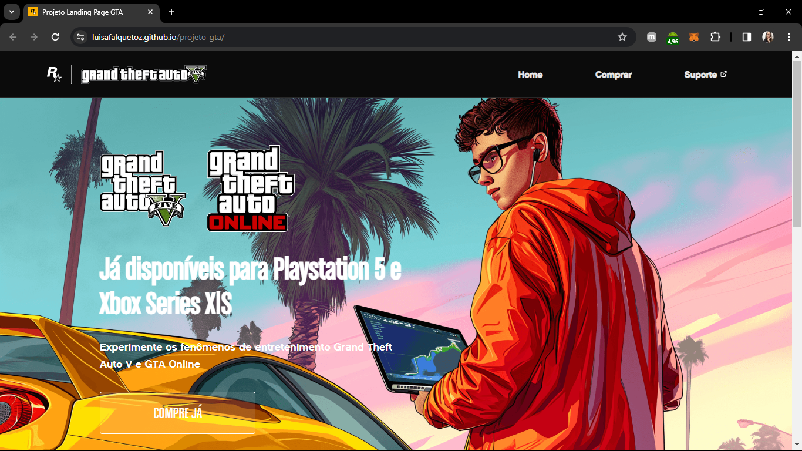

## Projeto GTA


## 📖 Sobre o Projeto 
Projeto desenvolvido no Evento do DevEmDobro. 
- Disponível em: https://luisafalquetoz.github.io/projeto-gta/

## 🚀 Tecnologias Utilizadas
<div style="display: inline_block">
<p>HTML</p>
<p>CSS</p>
<p>JavaScript</p>
</div>

## 📥 Instalação

Clone o repositório e acesse a pasta:

```
# Clone este repositório
git clone https://github.com/luisafalquetoz/projeto-gta.git

# Acesse a pasta do projeto
cd projeto-gta
```

## ▶️ Como Usar
Para rodar o projeto: 
- Baixe a extenssão Live Sever
- Abra o arquivo HTML clicando com o botão direito e escolha a opção Open with Live Server.

## 📬 Contato
Caso tenha dúvidas ou sugestões, entre em contato:

Nome: Luisa Falqueto

E-mail: luisafzandonade@gmail.com

LinkedIn: [LinkedIn](https://www.linkedin.com/in/luisa-falqueto/)

GitHub: [GitHub](https://github.com/luisafalquetoz)
